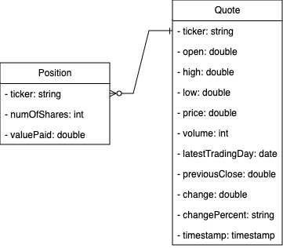
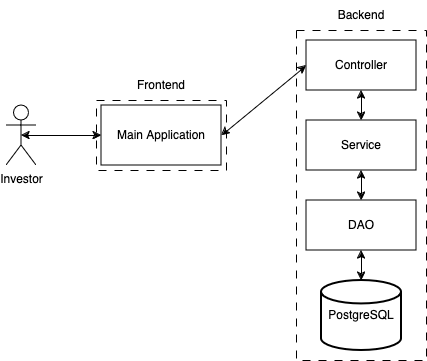

# Introduction
This project is a CRUD Backend application that help users manage their investment on any ticker on the Alpha Vantage stock exchange. It is an exercise to practice the flow of data through a Controller-Service-Repository pattern. The application is written in Java through the Maven build system leveraging JDBC, HTTP and JSON libraries to handle the persistence of each investment transaction and latest ticker value.  
## Technologies
- **Java:** Implement the stock application using the Controller-Service-Repository pattern. It handles the request to the third-party API: Alpha Vantage.
- **Maven:** Compile the application and append HTTP, JSON, Apache and testing libraries.
- **Docker:** Wrap the Java application in a container to run the program in isolation
- **PostgreSQL:** Persist stock quote and user transactions in relational database management system.
- **JUnit:** Test the application in isolation with a unit testing layer and through all layers with an integration layer.
- **Mockito:** De-couple dependencies to allow unit tests to be verified in isolation.
- **SLF4J Logging:** Generate application log through the console and as a file using the Log4 library.
- **Google Format:** Format existing Java code based on the Google Format standard on compile time.
- **Git:** Keep track of the project progress.

# Quick Start
To start using the application
1. Clone the repository
```
cd $HOME
git clone https://github.com/jarviscanada/jarvis_data_eng_BrandonWong.git
cd $HOME/jarvis_data_eng_BrandonWong/core_java/jdbc
```
2. Package the Java Stock application
```
mvn clean compile package
```
3. Login to Docker Hub
```
docker_user=<docker-id>
docker login -u ${docker_user} --password-stdin
```
4. Build a new Docker image
```
docker build -t ${docker_user}/stockquote .
docker image ls | stockquote "stockquote" # To verify if image exists
```
5. Run Docker image
```
docker run --rm \
-v `pwd`/data:/data -v `pwd/log:/log \
${docker_user}/stockquote <symbol> <buy/sell> [<num_of_shares>]
```

# Implementation
## ER Diagram
The following diagram is represented through two entities: 1. Quote which represents the list of quotes based on their ticker; 2. Position which represents the action performed by the user on a specific quote. In other words, Quote has the ticker as its primary key and position refers to quote's primary key.
<p align="center">
  
</p>

## Design Patterns
The application is design such that the user (investor) inputs the parameters such as the symbol, number of shares and the action of buying/selling through the Frontend layer, and it communicates with the Backend layer to execute the appropriate command. 

The heart of the application is in the Backend layer where we use the Controller-Service-Repository pattern. This pattern allows a separation of concern in the following fashion: 1. Controller describes the business logic; 2. Service defines the actionable task; 3. DAO communicates directly to the persistence layer (PostgreSQL).
<p align="center">
  
</p>

# Test
To test the application, we have set up two testing layer: 1. Unit Test to verify the behaviour of a specific task in isolation; 2. Integration test to verify the business logic. The unit test was performed using Mockito so that we can mock any component dependencies and ensure the task is performed in isolation. Furthermore, we used JUnit 5 to write the unit and integration testing layer such that we can attach it to the maven testing phase.

# Deployment
The application is packaged using **Maven** and containerized using **Docker**.

# Improvements
- Change the Quote primary key to be compound primary key with its latest trading day to avoid unique key constraint and allow a track record of the quote price without re-calling the API for previous records.
- Implement BDD to ensure that the business logic can be defined in the perspective of the user.
- Use a testing database instance so that we can test the DAO in isolation and without affecting the production database.